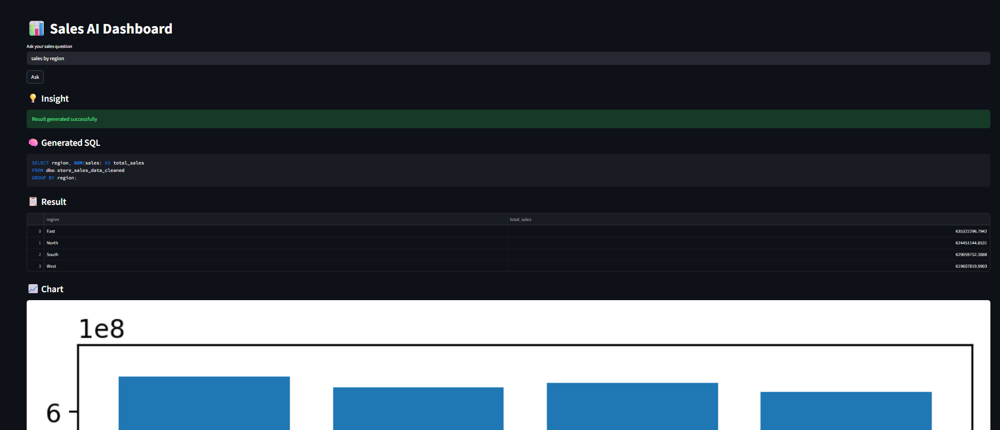

# 📊 Sales AI Dashboard (Self Hosted)

An AI-powered analytics dashboard that converts natural language queries into SQL and visualizes results in real time.

## 🚀 Features
- Natural Language → SQL (via Ollama - Mistral)
- FastAPI backend for query processing
- SQL Server integration
- Streamlit dashboard for visualization
- Automatic charts and insights
- Fully self-hosted (no external API dependency)

## 🛠️ Tech Stack
- FastAPI
- Streamlit
- Ollama (Mistral LLM)
- SQL Server
- Python

## ⚙️ Setup

### 1. Install dependencies
```bash
pip install -r requirements.txt
```

---

## 📸 Demo



